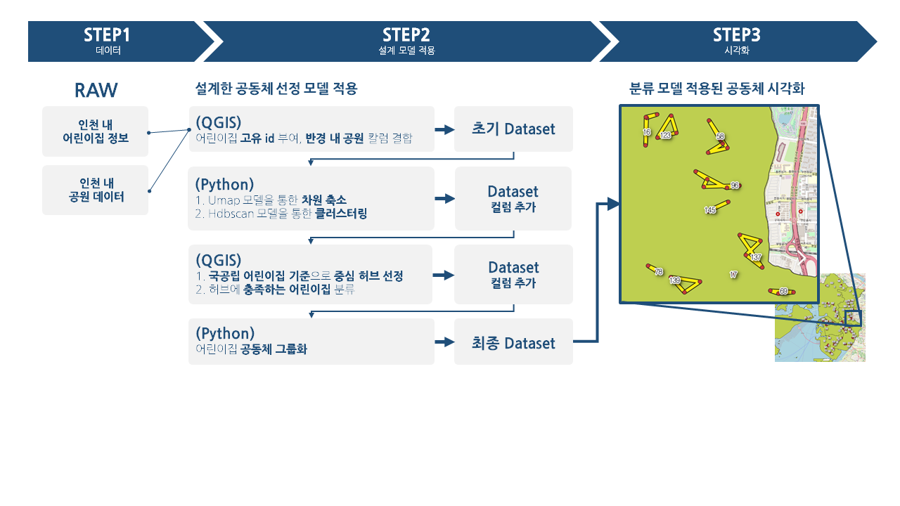
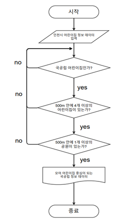
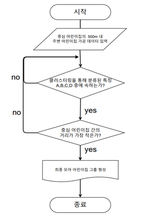
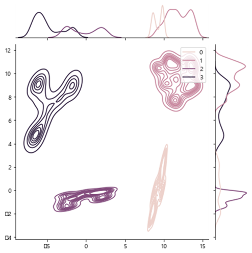
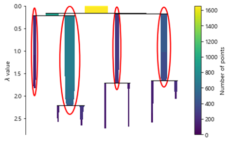
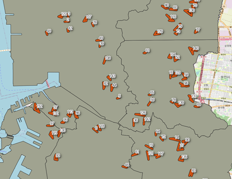
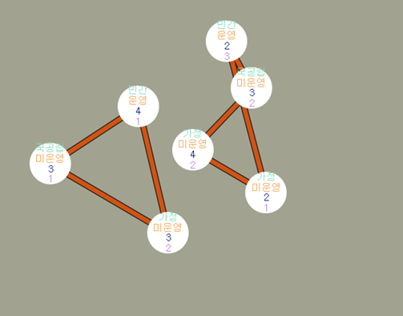

# 공동 보육을 위한 어린이집 공동체 분류 모델
## 분석 개요
새로운 ‘공유 어린이집’ 분류 모델을 제작하여 ‘서울형 모아어린이집’ 보육 지원 사업의 전국 확대 시 더 효율적으로 적용될 수 있도록 한다. 
각 어린이집의 국공립/사립 여부, 정원수, 보육실 수, 공원, 사회 복지 시설 같은 특징과 지리적 특징을 고려하여 공유 어린이집을 구성하였다. 
## 분석 프로세스

  - 6가지 기준을 적용하여 우선적으로 시범 운영할 지역 탐색 -> 인천 지역 채택
  - 인천광역시의 어린이집 통합 데이터에 대해 umap 차원축소 후, hdbscan 분석 방법을 적용해 어린이집 군집화
  - 모아 어린이집 공동체의 중심으로써 안정적으로 기능할 국공립어린이집 확인
  - 소속 군집별로 국공립어린이집으로부터 최소 거리인 어린이집 추출

## 어린이집 특징 차원축소 및 클러스터링 결과
  - T-SNE는 비선형적인 차원축소 방법이다. 기본적인 원리는 고차원의 데이터 간 거리를 저차원으로 축소하였을 때도 똑같이 유지. 점들의 유사도를 기반으로 축소하며, 점들의 유사도는 A를 중심으로 한 정규 분포에서 확률 밀도에 비례하여 이웃을 선택하면 포인트 A가 포인트 B를 이웃으로 선택한다는 조건부 확률로 계산된다.
  - 임베딩 차원에서도 잘 확장이 된다. 단순히 시각화를 위해서가 아니라 다른 기계 학습 작업에 대한 예비 단계로 범용 축소 기술로 사용할 수 있다. 특히 hdbscan 클러스러팅과 잘 협력한다.

  
## 최종 분석 결과

